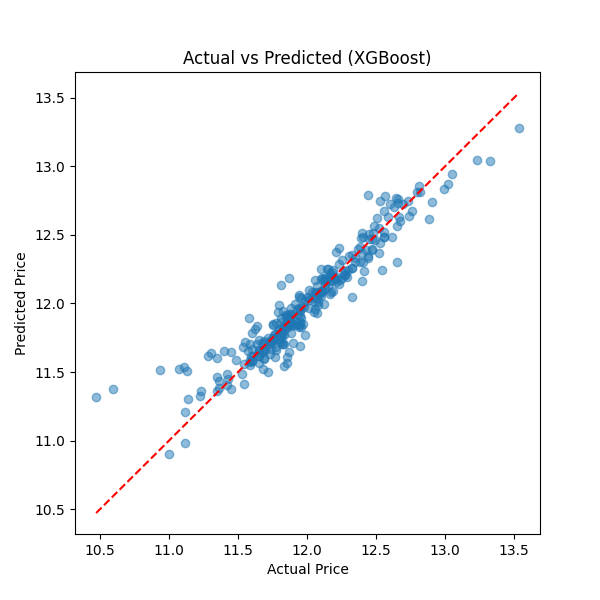
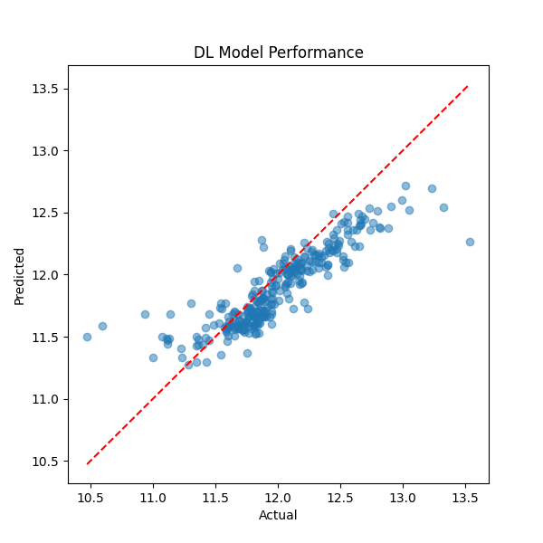

# 🏠 ML vs DL - House Price Prediction

A comparative study of Machine Learning and Deep Learning models for predicting house prices using the same dataset.
The goal of this project is to understand **which approach performs better (ML vs DL)** on tabular data and why.

---

## 📌 Project Overview

In this project, I built and compared multiple models:

* Traditional **Machine Learning models**
* A basic **Deep Learning (ANN) model**

Both were trained on the same dataset and evaluated using **RMSE (Root Mean Squared Error)** to measure performance.

---

## 📊 Dataset

* Source: Kaggle
* Dataset: **House Prices - Advanced Regression Techniques**

This dataset contains various features like:

* Area, number of rooms
* Year built
* Location-related features
  and more, which are used to predict house prices.

---

## 🤖 Models Used

### 🔹 Machine Learning Models

* Linear Regression
* Decision Tree Regressor
* XGBoost Regressor ✅ *(Best ML Model)*

### 🔹 Deep Learning Model

* Simple Artificial Neural Network (ANN)

---

## 📏 Evaluation Metric

**RMSE (Root Mean Squared Error)**

* Measures the difference between actual and predicted values
* Lower RMSE = Better model performance

---

## 📈 Results

| Model               | Performance (RMSE)               |
| ------------------- | -------------------------------- |
| Linear Regression   | Moderate                         |
| Decision Tree       | Higher Error                     |
| XGBoost             | ⭐ Best (Lowest RMSE)             |
| Deep Learning (ANN) | Good but not better than XGBoost |

---

## 📊 Visualizations

### 🔹 XGBoost Model Performance



### 🔹 Deep Learning Model Performance



*(Graphs show Actual vs Predicted values for better understanding of model performance)*

---

## 🧠 Key Insights

* **XGBoost performed best** among all models
* Deep Learning did not outperform ML in this case
* For **structured/tabular data**, traditional ML models can often perform better than basic DL models
* DL models may require:

  * More data
  * Better tuning
  * More complex architecture

---

## ✅ Conclusion

This project shows that:

> **Machine Learning models (especially XGBoost) can outperform Deep Learning on tabular datasets when data is limited or not highly complex.**

Deep Learning is powerful, but not always the best choice for every problem.

---

## 📂 Project Structure

```
ML-vs-DL-house-price-prediction/
│
├── data/
├── notebooks/
│   ├── 01_ml_model.ipynb
│   ├── 02_dl_model.ipynb
│   └── 03_comparison.ipynb
│
├── results/
│   ├── XGBoost_model_graph.png
│   ├── dl_model_graph.png
│   └── final_results.csv
│
└── README.md
```

---

## 👨‍💻 Author

**Samir**
Learning AI & Machine Learning 🚀
